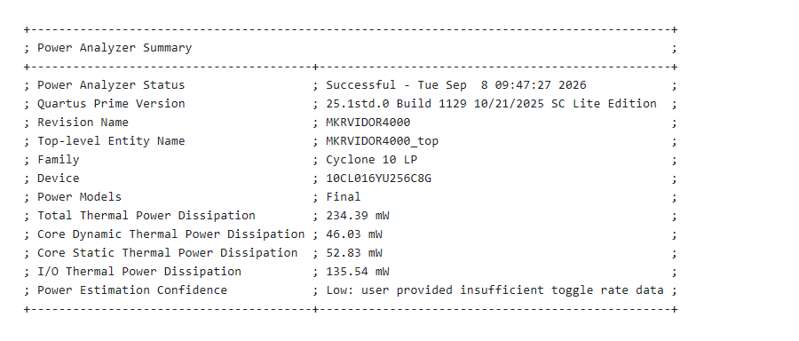
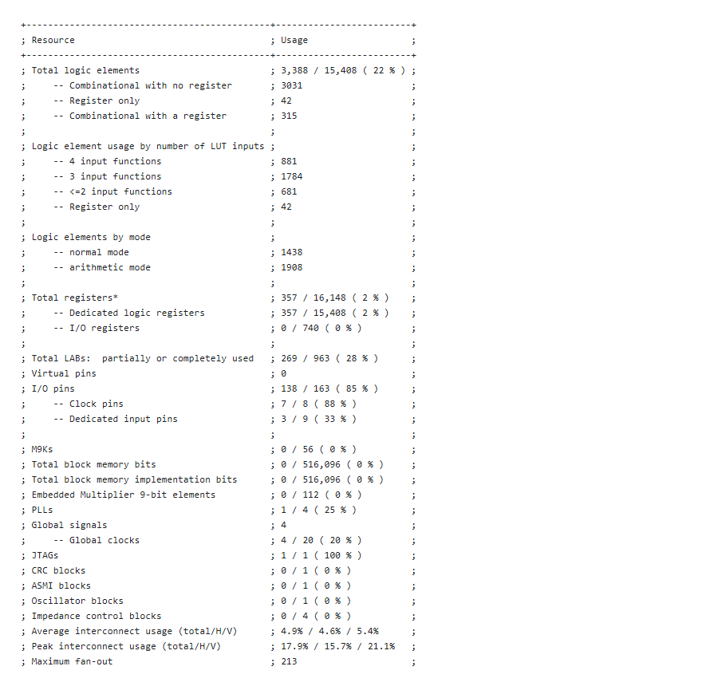
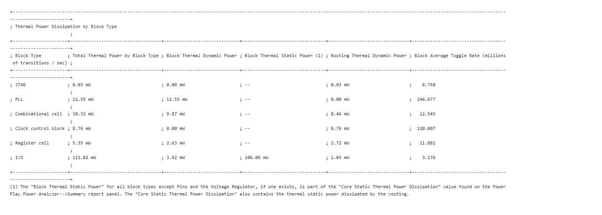
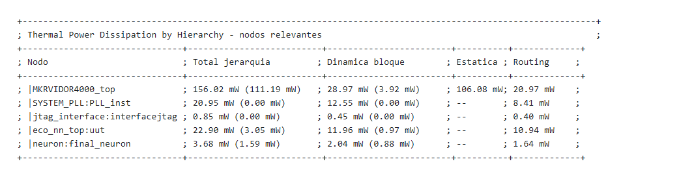
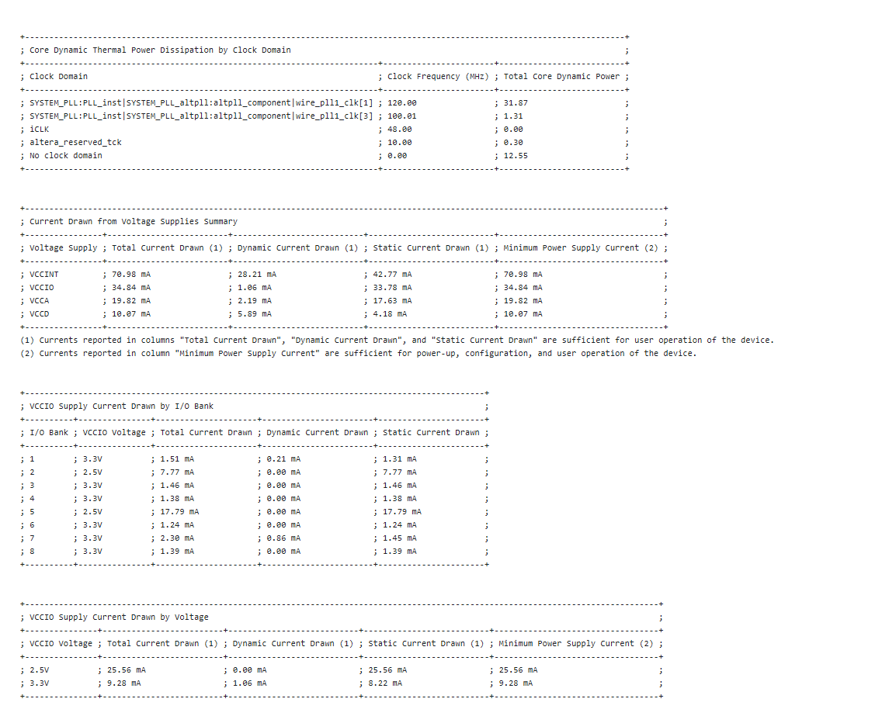
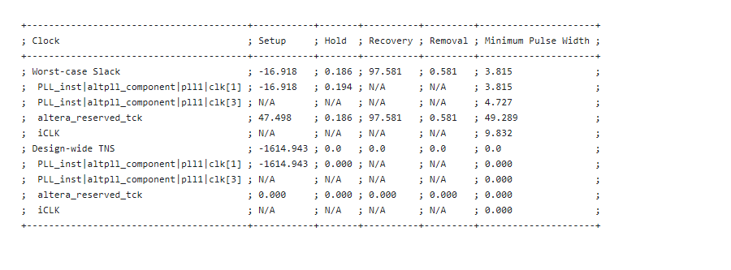
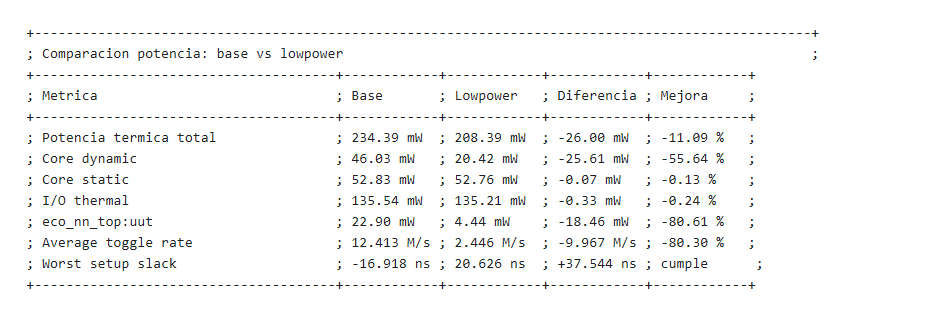
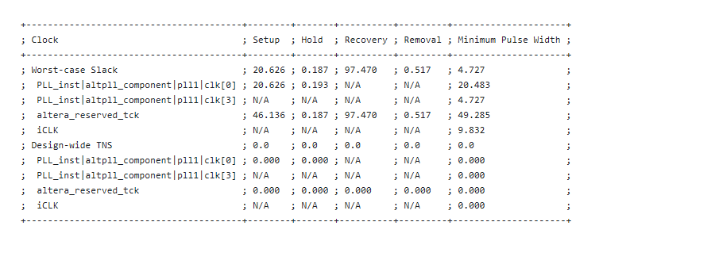

# Informe Quartus - Potencia y recursos DEEPCEL

Fecha del analisis: 2026-09-08

**Actualizacion: ambos proyectos Quartus 25.1 ya funcionan en placa con los constraints originales. Los resultados vigentes estan en la seccion 19. Las secciones 1-18 y sus capturas conservan las compilaciones y pruebas anteriores; sus cifras no describen los binarios actuales.**

Este informe resume los resultados obtenidos con Quartus Prime Lite sobre la copia de trabajo:

`QuartusProject/ANeural_Network_power25`

El proyecto original `ANeural_Network` se conserva. La fase inicial uso una copia para recompilar con Quartus 25.1 y ejecutar Power Analyzer. Las fases posteriores incluyeron cargas normales por USB y pruebas funcionales en placa, descritas en las secciones 18 y 19.

## 1. Archivos usados

| Elemento | Ruta |
|---|---|
| Proyecto analizado | `QuartusProject/ANeural_Network_power25` |
| Resumen de potencia | `QuartusProject/ANeural_Network_power25/output_files/MKRVIDOR4000.pow.summary` |
| Reporte completo de potencia | `QuartusProject/ANeural_Network_power25/output_files/MKRVIDOR4000.pow.rpt` |
| Resumen de recursos | `QuartusProject/ANeural_Network_power25/output_files/MKRVIDOR4000.fit.summary` |
| Reporte completo de recursos | `QuartusProject/ANeural_Network_power25/output_files/MKRVIDOR4000.fit.rpt` |
| Resumen de timing | `QuartusProject/ANeural_Network_power25/output_files/MKRVIDOR4000.sta.summary` |
| Reporte completo de timing | `QuartusProject/ANeural_Network_power25/output_files/MKRVIDOR4000.sta.rpt` |
| Capturas generadas | `capturas_quartus/` |

## 2. Configuracion del analisis

| Campo | Valor |
|---|---|
| Herramienta | Quartus Prime Lite |
| Version | `25.1std.0 Build 1129 10/21/2025 SC Lite Edition` |
| Revision | `MKRVIDOR4000` |
| Top-level entity | `MKRVIDOR4000_top` |
| FPGA | Cyclone 10 LP |
| Dispositivo | `10CL016YU256C8G` |
| Modelos de potencia | Final |
| Estimacion de actividad | Vectorless estimation |
| Fichero de actividad real | No usado |

Restriccion de reloj anadida para el analisis:

```tcl
create_clock -name iCLK -period 20.833 [get_ports {iCLK}]

derive_pll_clocks
derive_clock_uncertainty
```

Esto define `iCLK` como reloj de 48 MHz y deja que Quartus derive los relojes internos del PLL.

## 3. Resumen ejecutivo

| Resultado | Valor | Comentario |
|---|---:|---|
| Compilacion Quartus | Correcta | El flujo termino como `Successful` |
| Potencia termica total estimada | 234.39 mW | Estimacion de la FPGA, no de toda la placa MKR |
| Potencia dinamica de core | 46.03 mW | Actividad logica estimada |
| Potencia estatica de core | 52.83 mW | Corriente de fuga del dispositivo |
| Potencia de I/O | 135.54 mW | Es la parte dominante del total |
| Potencia dinamica estimada del modelo `eco_nn_top:uut` | 22.90 mW | Valor por jerarquia, incluye subniveles |
| Confianza de potencia | Low | Falta actividad real de simulacion `.vcd` o `.saif` |
| Peor slack de setup | -16.918 ns | Hay incumplimiento de timing en el dominio de 120 MHz |

## 4. Captura del resumen de Power Analyzer



## 5. Recursos FPGA usados

| Recurso | Uso |
|---|---:|
| Logic elements | 3,388 / 15,408 (22 %) |
| Combinational functions | 3,346 / 15,408 (22 %) |
| Dedicated logic registers | 357 / 15,408 (2 %) |
| Total registers | 357 |
| Pins | 138 / 163 (85 %) |
| Virtual pins | 0 |
| Memory bits | 0 / 516,096 (0 %) |
| Embedded Multiplier 9-bit elements | 0 / 112 (0 %) |
| PLLs | 1 / 4 (25 %) |

Captura de la tabla de Quartus:



Interpretacion: el diseno ocupa poca logica respecto a la FPGA disponible, pero usa muchos pines. No usa memoria M9K ni multiplicadores embebidos de 9 bits, por lo que los multiplicadores del modelo parecen implementarse con logica general.

## 6. Potencia total

| Categoria | Potencia |
|---|---:|
| Total Thermal Power Dissipation | 234.39 mW |
| Core Dynamic Thermal Power Dissipation | 46.03 mW |
| Core Static Thermal Power Dissipation | 52.83 mW |
| I/O Thermal Power Dissipation | 135.54 mW |

La potencia de I/O es mayor que la dinamica de core. Esto encaja con un diseno que conserva muchos pines definidos aunque la logica interna no sea grande.

## 7. Potencia por tipo de bloque

| Tipo de bloque | Potencia total | Dinamica de bloque | Estatica de bloque | Dinamica de routing | Toggle medio |
|---|---:|---:|---:|---:|---:|
| JTAG | 0.03 mW | 0.00 mW | -- | 0.03 mW | 8.750 Mtrans/s |
| PLL | 12.55 mW | 12.55 mW | -- | 0.00 mW | 146.677 Mtrans/s |
| Combinational cell | 18.32 mW | 9.87 mW | -- | 8.44 mW | 12.545 Mtrans/s |
| Clock control block | 8.76 mW | 0.00 mW | -- | 8.76 mW | 120.007 Mtrans/s |
| Register cell | 5.35 mW | 2.63 mW | -- | 2.72 mW | 11.882 Mtrans/s |
| I/O | 111.02 mW | 3.92 mW | 106.08 mW | 1.03 mW | 3.176 Mtrans/s |

Captura de la tabla de Quartus:



## 8. Potencia por jerarquia

Quartus indica que el valor entre parentesis es la potencia consumida en ese nivel concreto. El valor sin parentesis incluye ese nivel mas todos los niveles inferiores de la jerarquia.

| Nodo | Potencia total de jerarquia | Dinamica de bloque | Estatica | Routing |
|---|---:|---:|---:|---:|
| `MKRVIDOR4000_top` | 156.02 mW (111.19 mW) | 28.97 mW (3.92 mW) | 106.08 mW (106.08 mW) | 20.97 mW (1.20 mW) |
| `SYSTEM_PLL:PLL_inst` | 20.95 mW (0.00 mW) | 12.55 mW (0.00 mW) | -- | 8.41 mW (0.00 mW) |
| `jtag_interface:interfacejtag` | 0.85 mW (0.00 mW) | 0.45 mW (0.00 mW) | -- | 0.40 mW (0.00 mW) |
| `eco_nn_top:uut` | 22.90 mW (3.05 mW) | 11.96 mW (0.97 mW) | -- | 10.94 mW (2.08 mW) |
| `neuron:final_neuron` | 3.68 mW (1.59 mW) | 2.04 mW (0.88 mW) | -- | 1.64 mW (0.71 mW) |

Captura resumida con los nodos relevantes:



Lectura practica: si se habla del bloque del modelo neuronal como jerarquia `eco_nn_top:uut`, la estimacion mas util es aproximadamente 22.90 mW dinamicos incluyendo subniveles. La estatica global no se reparte entre subjerarquias, por eso no debe sumarse directamente como si fuese una potencia completa independiente del modelo.

## 9. Potencia dinamica por dominio de reloj

| Dominio de reloj | Frecuencia | Potencia dinamica core |
|---|---:|---:|
| `SYSTEM_PLL:PLL_inst|SYSTEM_PLL_altpll:altpll_component|wire_pll1_clk[1]` | 120.00 MHz | 31.87 mW |
| `SYSTEM_PLL:PLL_inst|SYSTEM_PLL_altpll:altpll_component|wire_pll1_clk[3]` | 100.01 MHz | 1.31 mW |
| `iCLK` | 48.00 MHz | 0.00 mW |
| `altera_reserved_tck` | 10.00 MHz | 0.30 mW |
| No clock domain | 0.00 MHz | 12.55 mW |

El dominio de 120 MHz concentra la mayor parte de la potencia dinamica de core.

## 10. Corriente estimada por rail

| Rail | Corriente total | Corriente dinamica | Corriente estatica | Corriente minima de fuente |
|---|---:|---:|---:|---:|
| VCCINT | 70.98 mA | 28.21 mA | 42.77 mA | 70.98 mA |
| VCCIO | 34.84 mA | 1.06 mA | 33.78 mA | 34.84 mA |
| VCCA | 19.82 mA | 2.19 mA | 17.63 mA | 19.82 mA |
| VCCD | 10.07 mA | 5.89 mA | 4.18 mA | 10.07 mA |

## 11. Corriente VCCIO por banco

| Banco I/O | Tension VCCIO | Corriente total | Corriente dinamica | Corriente estatica |
|---|---:|---:|---:|---:|
| 1 | 3.3 V | 1.51 mA | 0.21 mA | 1.31 mA |
| 2 | 2.5 V | 7.77 mA | 0.00 mA | 7.77 mA |
| 3 | 3.3 V | 1.46 mA | 0.00 mA | 1.46 mA |
| 4 | 3.3 V | 1.38 mA | 0.00 mA | 1.38 mA |
| 5 | 2.5 V | 17.79 mA | 0.00 mA | 17.79 mA |
| 6 | 3.3 V | 1.24 mA | 0.00 mA | 1.24 mA |
| 7 | 3.3 V | 2.30 mA | 0.86 mA | 1.45 mA |
| 8 | 3.3 V | 1.39 mA | 0.00 mA | 1.39 mA |

| Tension VCCIO | Corriente total | Corriente dinamica | Corriente estatica | Corriente minima de fuente |
|---|---:|---:|---:|---:|
| 2.5 V | 25.56 mA | 0.00 mA | 25.56 mA | 25.56 mA |
| 3.3 V | 9.28 mA | 1.06 mA | 8.22 mA | 9.28 mA |

Captura conjunta de dominios de reloj, rails y bancos VCCIO:



## 12. Condiciones termicas

| Parametro | Valor |
|---|---:|
| Device power characteristics | Typical |
| VCCINT | 1.20 V |
| VCCA | 2.50 V |
| VCCD | 1.20 V |
| I/O 3.3 V | 3.3 V |
| I/O 2.5 V | 2.5 V |
| Temperatura ambiente | 25.0 C |
| Temperatura de union estimada | 28.3 C |
| Board model | None |

## 13. Timing

| Reloj / medida | Setup | Hold | Recovery | Removal | Minimum pulse width |
|---|---:|---:|---:|---:|---:|
| Worst-case Slack | -16.918 ns | 0.186 ns | 97.581 ns | 0.581 ns | 3.815 ns |
| `PLL_inst|altpll_component|pll1|clk[1]` | -16.918 ns | 0.194 ns | N/A | N/A | 3.815 ns |
| `PLL_inst|altpll_component|pll1|clk[3]` | N/A | N/A | N/A | N/A | 4.727 ns |
| `altera_reserved_tck` | 47.498 ns | 0.186 ns | 97.581 ns | 0.581 ns | 49.289 ns |
| `iCLK` | N/A | N/A | N/A | N/A | 9.832 ns |

| TNS | Setup | Hold | Recovery | Removal | Minimum pulse width |
|---|---:|---:|---:|---:|---:|
| Design-wide TNS | -1614.943 ns | 0.0 ns | 0.0 ns | 0.0 ns | 0.0 ns |

Captura de Quartus:



El diseno no cumple setup en el dominio derivado de PLL a 120 MHz. Esto no invalida que Power Analyzer pueda dar una estimacion de potencia, pero si es una senal de riesgo funcional si se pretende ejecutar la FPGA a esa frecuencia.

## 14. Confianza de la estimacion

| Fuente de actividad | Total |
|---|---:|
| Toggle rate desde simulacion | 0 senales (0.0 %) |
| Static probability desde simulacion | 0 senales (0.0 %) |
| Toggle rate desde asignacion de nodo, entidad o reloj | 4 senales (0.1 %) |
| Static probability desde asignacion de nodo, entidad o reloj | 4 senales (0.1 %) |
| Toggle rate desde vectorless estimation | 5774 senales (98.1 %) |
| Static probability desde vectorless estimation | 5774 senales (98.1 %) |
| Toggle rate por asignacion por defecto | 2 senales (0.0 %) |
| Static probability por asignacion por defecto | 106 senales (1.8 %) |

La confianza aparece como `Low` porque casi toda la actividad se ha inferido automaticamente. Para obtener un valor mas defendible haria falta generar actividad real con simulacion, por ejemplo `.vcd` o `.saif`, y repetir `quartus_pow` usando ese fichero.

## 15. Conclusiones

1. El diseno compila en la copia `ANeural_Network_power25` con Quartus 25.1.
2. La FPGA completa queda estimada en 234.39 mW de potencia termica total.
3. El bloque del modelo `eco_nn_top:uut` queda en torno a 22.90 mW de potencia dinamica jerarquica estimada.
4. La estimacion es util para una primera aproximacion, pero no es una medicion fisica de la placa MKR completa.
5. El principal problema tecnico detectado no es de potencia, sino de timing: el dominio de 120 MHz presenta slack negativo de -16.918 ns.

## 16. Siguientes pasos recomendados

| Objetivo | Accion |
|---|---|
| Mejorar precision de potencia | Simular el modelo con actividad real y exportar `.vcd` o `.saif` |
| Validar funcionamiento en FPGA | Resolver el slack negativo del dominio de 120 MHz o reducir frecuencia |
| Separar consumo del modelo y del wrapper | Aislar `eco_nn_top` en un banco de pruebas sintetizable mas pequeno |
| Medir placa real | Medir corriente en alimentacion de la MKR Vidor y descontar consumo base si hace falta |

## 17. Comparacion con proyecto optimizado lowpower

Resultado historico: esta version bajaba tambien el puente JTAG a 24 MHz y no supero la prueba de comunicacion. La version corregida y su consumo estan en la seccion 19.

Se ha creado una copia separada del proyecto para probar los dos primeros cambios de mejora de consumo:

`QuartusProject/ANeural_Network_power25_lowpower`

Cambios aplicados:

| Cambio | Archivo | Descripcion |
|---|---|---|
| Reloj mas bajo para modelo e interfaz JTAG | `QuartusProject/ANeural_Network_power25_lowpower/MKRVIDOR4000_top.v` | Se define `wNN_CLK = wCLK24` y se usa para `eco_nn_top` e `interfacejtag` en vez de `wCLK120` |
| Enable por pulso de `data_ready` | `QuartusProject/ANeural_Network_power25_lowpower/eco_nn_top.v` | Se genera `sample_pulse` por flanco de subida y se habilitan las capas en pipeline |
| Neuronas con enable | `QuartusProject/ANeural_Network_power25_lowpower/neuron.v` | Cada neurona solo recalcula cuando `enable` esta activo; en reposo mantiene la salida |

La interfaz de Arduino se mantiene igual: mismo numero de registros JTAG, misma entrada `sensor_in`, misma senal `data_ready` y misma salida `prediction`. El cambio relevante de comportamiento temporal es que la prediccion nueva queda disponible unos ciclos de `wNN_CLK` despues del pulso, lo cual no afecta al programa Arduino actual porque espera `delay(10)` antes de leer la prediccion.

### 17.1 Archivos de salida del proyecto optimizado

| Elemento | Ruta |
|---|---|
| Proyecto optimizado | `QuartusProject/ANeural_Network_power25_lowpower` |
| Resumen de potencia | `QuartusProject/ANeural_Network_power25_lowpower/output_files/MKRVIDOR4000.pow.summary` |
| Reporte completo de potencia | `QuartusProject/ANeural_Network_power25_lowpower/output_files/MKRVIDOR4000.pow.rpt` |
| Resumen de recursos | `QuartusProject/ANeural_Network_power25_lowpower/output_files/MKRVIDOR4000.fit.summary` |
| Resumen de timing | `QuartusProject/ANeural_Network_power25_lowpower/output_files/MKRVIDOR4000.sta.summary` |

### 17.2 Comparacion de potencia

| Metrica | Base `power25` | Optimizado `lowpower` | Diferencia | Mejora |
|---|---:|---:|---:|---:|
| Potencia termica total | 234.39 mW | 208.39 mW | -26.00 mW | -11.09 % |
| Core dynamic | 46.03 mW | 20.42 mW | -25.61 mW | -55.64 % |
| Core static | 52.83 mW | 52.76 mW | -0.07 mW | -0.13 % |
| I/O thermal | 135.54 mW | 135.21 mW | -0.33 mW | -0.24 % |
| Jerarquia `eco_nn_top:uut` | 22.90 mW | 4.44 mW | -18.46 mW | -80.61 % |
| `jtag_interface:interfacejtag` | 0.85 mW | 0.36 mW | -0.49 mW | -57.65 % |
| `SYSTEM_PLL:PLL_inst` | 20.95 mW | 14.99 mW | -5.96 mW | -28.45 % |
| Toggle medio del diseno | 12.413 Mtrans/s | 2.446 Mtrans/s | -9.967 Mtrans/s | -80.30 % |

Captura comparativa:



Captura del resumen Power Analyzer optimizado:


### 17.3 Comparacion de recursos

| Recurso | Base `power25` | Optimizado `lowpower` | Diferencia |
|---|---:|---:|---:|
| Logic elements | 3,388 / 15,408 (22 %) | 3,321 / 15,408 (22 %) | -67 |
| Combinational functions | 3,346 / 15,408 (22 %) | 3,280 / 15,408 (21 %) | -66 |
| Dedicated logic registers | 357 / 15,408 (2 %) | 360 / 15,408 (2 %) | +3 |
| Total registers | 357 | 360 | +3 |
| Pins | 138 / 163 (85 %) | 138 / 163 (85 %) | 0 |
| Memory bits | 0 / 516,096 (0 %) | 0 / 516,096 (0 %) | 0 |
| Embedded Multiplier 9-bit elements | 0 / 112 (0 %) | 0 / 112 (0 %) | 0 |
| PLLs | 1 / 4 (25 %) | 1 / 4 (25 %) | 0 |

La pequena subida de 3 registros corresponde al detector de flanco y al pipeline de enables. A cambio, baja la logica combinacional y cae de forma fuerte la potencia dinamica estimada.

### 17.4 Comparacion por tipo de bloque

| Tipo de bloque | Base | Optimizado | Diferencia | Mejora |
|---|---:|---:|---:|---:|
| JTAG | 0.03 mW | 0.02 mW | -0.01 mW | -33.33 % |
| PLL | 12.55 mW | 12.22 mW | -0.33 mW | -2.63 % |
| Combinational cell | 18.32 mW | 3.37 mW | -14.95 mW | -81.60 % |
| Clock control block | 8.76 mW | 3.12 mW | -5.64 mW | -64.38 % |
| Register cell | 5.35 mW | 1.40 mW | -3.95 mW | -73.83 % |
| I/O | 111.02 mW | 109.96 mW | -1.06 mW | -0.95 % |

### 17.5 Comparacion por dominio de reloj

| Dominio | Base | Optimizado |
|---|---:|---:|
| Dominio principal del modelo | 120.00 MHz / 31.87 mW | 24.00 MHz / 18.78 mW |
| Dominio SDRAM clock derivado | 100.01 MHz / 1.31 mW | 100.01 MHz / 1.31 mW |
| `altera_reserved_tck` | 10.00 MHz / 0.30 mW | 10.00 MHz / 0.34 mW |
| No clock domain | 12.55 mW | 0.00 mW |

El ahorro principal viene de dejar de mover la red neuronal a 120 MHz. El PLL sigue existiendo porque no se ha aplicado todavia la optimizacion de eliminar relojes/salidas no usadas.

### 17.6 Comparacion de timing

| Metrica | Base `power25` | Optimizado `lowpower` | Resultado |
|---|---:|---:|---|
| Peor slack setup | -16.918 ns | 20.626 ns | Pasa de fallar a cumplir |
| Design-wide setup TNS | -1614.943 ns | 0.000 ns | Corregido |
| Peor slack hold | 0.186 ns | 0.187 ns | Sigue cumpliendo |
| Dominio critico | PLL 120 MHz | PLL 24 MHz | El dominio de modelo queda relajado |

Captura del timing optimizado:



### 17.7 Lectura de resultados

La optimizacion reduce la potencia total estimada un 11.09 %, pero la mejora real importante esta en la parte dinamica:

1. La potencia dinamica de core baja un 55.64 %.
2. La jerarquia del modelo `eco_nn_top:uut` baja un 80.61 %.
3. El toggle medio del diseno baja un 80.30 %.
4. El problema de timing a 120 MHz desaparece al mover el modelo a 24 MHz.

La potencia de I/O casi no cambia porque no se ha tocado el tercer punto de optimizacion: limpiar pines no usados y senales de plantilla. Por eso el consumo total no baja tanto como el consumo del modelo.

La confianza de Power Analyzer sigue siendo `Low` en ambos casos porque no se ha usado actividad real de simulacion. La comparacion es valida como estimacion relativa bajo el mismo metodo vectorless, pero para defender cifras finales conviene repetir el analisis con un fichero `.vcd` o `.saif`.

## 18. Intento de comparativa real en placa

Primer intento, conservado como historial. Los fallos de configuracion descritos aqui se resolvieron posteriormente; ver seccion 19.

Se ha probado la placa Arduino MKR Vidor 4000 conectada por `COM4` con el sensor DHT20. La comprobacion real realizada desde el PC ha sido funcional: cargar los sketches en la MKR, abrir el puerto serie y verificar si la FPGA se configura y si el flujo de temperatura produce salida.

No se ha podido obtener una comparativa real de consumo en mW desde software porque el PC solo expone la placa como puerto serie USB. Para medir consumo real hace falta instrumentacion externa, por ejemplo un medidor USB de corriente, una fuente de laboratorio con lectura de corriente o una resistencia shunt con adquisicion de tension. Sin esa medida fisica, Quartus solo puede dar una estimacion.

### 18.1 Resultado de las pruebas en hardware

| Prueba | Bitstream usado | Carga en SAMD21 | Configuracion FPGA | Salida observada por serie |
|---|---|---:|---:|---|
| Sketch original `Temperature_real` | `Temperature_real/FPGA_Bitstream.h` existente | Correcta | Correcta | `FPGA successfully configured!`, `DHT20 sensor detected.`, temperatura real y prediccion FPGA |
| Proyecto base recompilado | `QuartusProject/ANeural_Network_power25/output_files/MKRVIDOR4000.ttf` | Correcta | Falla | `ERROR: Unable to configure the FPGA.` |
| Proyecto optimizado low-power | `QuartusProject/ANeural_Network_power25_lowpower/output_files/MKRVIDOR4000.ttf` | Correcta | Falla | `ERROR: Unable to configure the FPGA.` |

La placa quedo restaurada al sketch original `Temperature_real` despues de las pruebas. En la lectura final por `COM4` se volvio a ver la configuracion correcta de la FPGA, deteccion del DHT20 y valores de ejemplo alrededor de `26.62 C` con prediccion FPGA alrededor de `26.34 C`.

### 18.2 Logs generados

| Fichero | Contenido |
|---|---|
| `comparativa_real_hw/base_serial.log` | Primer intento con bitstream base recompilado: fallo de configuracion FPGA |
| `comparativa_real_hw/base_25_error_serial.log` | Repeticion con diagnostico adicional: mismo fallo de configuracion FPGA |
| `comparativa_real_hw/lowpower_25_error_serial.log` | Intento con bitstream optimizado low-power: fallo de configuracion FPGA |
| `comparativa_real_hw/original_restaurado_serial.log` | Restauracion del sketch original: FPGA y DHT20 correctos |
| `comparativa_real_hw/original_restaurado_final_serial.log` | Segunda comprobacion del sketch original: FPGA y DHT20 correctos |
| `comparativa_real_hw/original_restaurado_post_lowpower_serial.log` | Comprobacion final tras probar low-power: FPGA y DHT20 correctos |

### 18.3 Interpretacion

La comparativa real de consumo queda pendiente porque el hardware conectado no proporciona medida electrica. Ademas, los bitstreams `.ttf` generados con la version migrada a Quartus 25.1 se cargan en la flash del SAMD21, pero no pasan la configuracion de la FPGA mediante `FPGA.begin(32, 2)`.

Esto apunta a un problema de generacion/empaquetado del bitstream o de compatibilidad con el flujo JTAG usado por la libreria `VidorPeripherals`, no necesariamente a un fallo funcional del cambio low-power en Verilog. El dato importante es que el bitstream original incluido en `Temperature_real/FPGA_Bitstream.h` si funciona en la placa, mientras que los `.ttf` generados ahora por Quartus 25.1 no arrancan la FPGA desde el sketch.

Para hacer una comparativa real completa habria que resolver primero la generacion de un `FPGA_Bitstream.h` compatible con la MKR Vidor 4000 a partir de cada proyecto Quartus y, despues, medir corriente fisica en las mismas condiciones para los dos sketches.

## 19. Versiones operativas con constraints originales

Validacion del 2026-09-08. Se recompilaron los proyectos base y lowpower, se regeneraron sus headers de bitstream y se probaron ambos en la misma MKR Vidor 4000 por COM4. La placa queda con `Temperature_real_lowpower_hwtest`, que ejecuta una autoprueba al arrancar y despues lee el DHT20 cada 10 segundos. El arranque sigue esperando a que se abra el puerto serie mediante `while (!Serial)`.

### 19.1 Constraints incorporados

| Archivo recibido | Comprobacion y uso |
|---|---|
| `MKRVIDOR4000/vidor_s_pins.qsf` | Los 131 destinos recuperados coinciden con el original. Ambos proyectos ahora incluyen directamente este archivo mediante una ruta relativa. |
| `MKRVIDOR4000/vidor_s.sdc` | Referencia para los SDC adaptados de ambos proyectos. Se mantienen el reloj de entrada, los relojes PLL, el reloj de salida SDRAM y la separacion asincrona de TCK. |
| Copias dentro de `MKRVIDOR4000/MKRVIDOR4000` | Tienen hashes identicos a los archivos del nivel superior. |
| Informes `.pin` despues de compilar | Los 138 pines asignados coinciden con la compilacion original en ubicacion, direccion y estandar electrico. Incluyen los pares diferenciales. |

El SDC original especifica TCK a 10 MHz, pero `FPGA.cpp` usa `SPISettings(12000000, ...)`: los SDC adaptados especifican 12 MHz, periodo 83.333 ns. La ruta jerarquica de la PLL se actualiza a la que realmente produce Quartus 25.1, sin `auto_generated`. No se importan restricciones de MIPI, Nios o AES ausentes, ni retardos de datos de un controlador SDRAM que este diseno no implementa. La salida fisica de reloj SDRAM sigue presente.

Los proyectos dependen de la carpeta `MKRVIDOR4000` situada en la raiz de DEEPCEL; debe conservarse al trasladarlos.

### 19.2 Causas del fallo y correcciones

| Problema observado | Correccion verificada |
|---|---|
| El `.ttf` copiado directamente no arranca con el cargador Arduino existente | Invertir los 8 bits dentro de cada byte al generar `FPGA_Bitstream.h`. La conversion del TTF original reproduce exactamente sus 175721 bytes conocidos como funcionales. |
| El puente JTAG a 24 MHz devuelve un identificador incorrecto | Mantener `jtag_interface.iMAIN_CLK` a 120 MHz. Solo la red neuronal baja a 24 MHz. |
| El detector de flanco introducido cambiaba la ventana del modelo | Conservar el muestreo por nivel del original, sincronizar `data_ready` con dos registros y habilitar las dos capas con el retardo de pipeline correspondiente. |
| Los mensajes de arranque pueden perderse si otro monitor abre COM4 | Los sketches de prueba permiten repetir la autoprueba enviando `T` por serie. |

En el modelo original la ventana avanza en cada ciclo mientras `data_ready` esta alto. El pulso que genera el sketch dura muchos ciclos de FPGA, por lo que termina llenando las cuatro posiciones con la temperatura actual. Esto se conserva para mantener el comportamiento del protocolo existente. La lista de cuatro lecturas que imprime Arduino no implica que la FPGA este utilizando cuatro lecturas historicas distintas.

### 19.3 Comparacion funcional en hardware

La autoprueba envia 128 valores Q8.8 deterministas entre 0 y 60 C, incluidos cambios bruscos y limites de cuantizacion. Compara cada resultado con una referencia de software que utiliza los mismos pesos, biases, truncamiento y ReLU. Lee dos veces cada salida, separadas por 1 ms, tras los 10 ms de espera del protocolo original. Se ejecuto al arrancar y se repitio mediante `T` en cada version.

| Comprobacion | Base 25.1 | Lowpower 25.1 |
|---|---:|---:|
| Carga USB y configuracion FPGA | Correctas | Correctas |
| Deteccion de DHT20 | Correcta | Correcta |
| Vectores por ejecucion de autoprueba | 128 | 128 |
| Lecturas por ejecucion | 256 | 256 |
| Diferencias con la referencia | 0 | 0 |
| Temperatura de ejemplo posterior | 27.43 C | 27.51 C |
| Prediccion correspondiente | 27.14 C | 27.21 C |

Las temperaturas de ejemplo se tomaron en instantes diferentes. La comparacion numerica controlada es la autoprueba con los mismos vectores. Su alcance es el protocolo Arduino actual con entrada estable y lectura diferida; no demuestra equivalencia ciclo a ciclo para pulsos arbitrarios ni valida la precision predictiva del modelo.

Los ensayos consistieron en cargas ordinarias por bootloader, transferencias JTAG y lecturas del sensor. No se cambiaron tensiones, conexiones ni asignaciones electricas para forzar pruebas.

### 19.4 Potencia estimada actual

Power Analyzer se volvio a ejecutar sobre las dos compilaciones con los mismos criterios vectorless. Informes base de las 11:23 y lowpower de las 11:22 del 2026-09-08.

| Metrica | Base 25.1 | Lowpower 25.1 | Diferencia |
|---|---:|---:|---:|
| Potencia termica total | 234.21 mW | 212.53 mW | -21.68 mW (-9.26 %) |
| Core dynamic | 45.81 mW | 24.51 mW | -21.30 mW (-46.50 %) |
| Core static | 52.83 mW | 52.77 mW | -0.06 mW |
| I/O thermal | 135.57 mW | 135.25 mW | -0.32 mW |
| Jerarquia `eco_nn_top:uut` | 22.86 mW | 4.71 mW | -18.15 mW (-79.40 %) |
| Jerarquia JTAG | 1.01 mW | 1.00 mW | -0.01 mW |
| Jerarquia PLL | 20.42 mW | 18.15 mW | -2.27 mW |
| Toggle medio | 12.315 Mtrans/s | 2.945 Mtrans/s | -9.370 Mtrans/s |
| Confianza de Power Analyzer | Low | Low | Sin actividad medida |

Estas cifras son estimaciones de potencia de la FPGA, no mediciones electricas de la tarjeta completa. Los logs serie no miden corriente. La medicion real de consumo sigue pendiente de instrumentacion externa. Tampoco se ha usado un VCD/SAIF de la prueba para alimentar Power Analyzer.

### 19.5 Recursos y timing actuales

| Metrica | Base 25.1 | Lowpower 25.1 |
|---|---:|---:|
| Logic elements | 3392 / 15408 | 3316 / 15408 |
| Funciones combinacionales | 3351 | 3281 |
| Registros | 357 | 361 |
| Pines | 138 | 138 |
| PLLs | 1 | 1 |
| Peor setup slack analizado | -12.760 ns | +6.873 ns |
| Setup slack del modelo a 24 MHz, esquina lenta 85 C | No aplica | +20.178 ns |
| Peor hold slack analizado | +0.186 ns | +0.186 ns |
| Compilacion completa | 0 errores, 187 avisos | 0 errores, 182 avisos |

La base funciona en esta prueba de placa pero incumple timing; eso impide garantizarla en todas las condiciones. Lowpower cumple las rutas analizadas. Permanece el aviso 332060 sobre `jtag_synchronizer:jtag_sync|synchronizer_basic:inst6|sync2`, usado como reloj sin constraint propio. Por ello no se declara cierre completo de timing/CDC. El aviso de sobrescritura de `altera_reserved_tck` corresponde al ajuste explicito de los 10 MHz embebidos en la IP a los 12 MHz usados por Arduino.

### 19.6 Evidencias y reproduccion

| Evidencia | Archivo |
|---|---|
| Arranque y autopruebas base | [base_25_original_constraints_serial.log](comparativa_real_hw/base_25_original_constraints_serial.log) |
| Arranque y autopruebas lowpower | [lowpower_25_original_constraints_serial.log](comparativa_real_hw/lowpower_25_original_constraints_serial.log) |
| Potencia base vigente | [MKRVIDOR4000.pow.rpt](QuartusProject/ANeural_Network_power25/output_files/MKRVIDOR4000.pow.rpt) |
| Potencia lowpower vigente | [MKRVIDOR4000.pow.rpt](QuartusProject/ANeural_Network_power25_lowpower/output_files/MKRVIDOR4000.pow.rpt) |
| Compilacion y cargas | `comparativa_real_hw/*_25_original_constraints_compile.log` y `*_upload.log` |
| Conversion reutilizable | [Convert-VidorBitstream.ps1](tools/Convert-VidorBitstream.ps1) |
| Captura y repeticion de prueba | [Capture-VidorSerial.ps1](tools/Capture-VidorSerial.ps1) |

Desde la raiz de DEEPCEL, despues de compilar Quartus, la conversion para lowpower es:

```powershell
powershell.exe -NoProfile -ExecutionPolicy Bypass -File .\tools\Convert-VidorBitstream.ps1 -InputPath .\QuartusProject\ANeural_Network_power25_lowpower\output_files\MKRVIDOR4000.ttf -OutputPath .\Temperature_real_lowpower_hwtest\FPGA_Bitstream.h
```

Despues se compila y carga `Temperature_real_lowpower_hwtest` para `arduino:samd:mkrvidor4000`. Con el puerto libre de otros monitores, se puede repetir la autoprueba y guardar 32 segundos de salida:

```powershell
powershell.exe -NoProfile -ExecutionPolicy Bypass -File .\tools\Capture-VidorSerial.ps1 -Port COM4 -Seconds 32 -RunSelfTest -OutputPath .\comparativa_real_hw\repeticion_lowpower_serial.log
```

Los scripts no cambian la politica permanente de PowerShell. El sketch original `Temperature_real` conserva su bitstream original; para reproducir la version nueva debe abrirse la carpeta `Temperature_real_lowpower_hwtest`.
